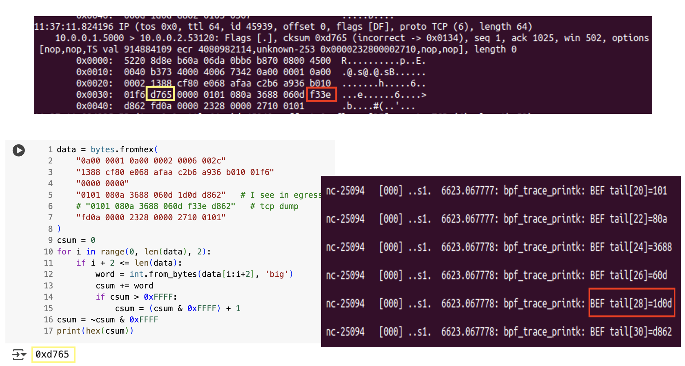

# C2L2

##### TABLE OF CONTENTS
- [C2L2](#c2l2)
  - [Workflow](#workflow)
    - [End-to-End Flow Summary](#end-to-end-flow-summary)
    - [P4 Switch (Forward Path)](#p4-switch-forward-path)
    - [Sender](#sender)
    - [Receiver](#receiver)
  - [Issues](#issues)
  - [ebpf](#ebpf)
  - [p4](#p4)
## Workflow
- ATU = numer / denom
```
header tcp_atu_opt_t {
    bit<8>  kind;     // 253
    bit<8>  len;      // 10
    bit<32> numer;
    bit<32> denom;
}

```

### End-to-End Flow Summary
```
Sender ── DATA ──> P4 Switch ── DATA+ATU ──> Receiver
   ↑                                         ↓
   │                                    Cache ATU
   │                                         ↓
   └──<──ACK+ATU(Kind=253)──<──────────────┘
```

### P4 Switch (Forward Path)
```
    Data packet (TCP, non-ACK)
         ↓
    Calculate ATU: numer = (rate_out + qdiff) << 3
                   denom = (queue_out << 4) + (queue_out << 3) + queue_out # queue_out * 25
         ↓
    Add ATU option to TCP header (Kind=253, Len=10)
         ↓
    Update IP/TCP lengths and checksums
         ↓
    Forward packet to receiver
```

### Sender
```
     TCP eBPF (tc/tx_ingress_parse_ack_opt)
         ↓
     Update BPF map (/sys/fs/bpf/ack_atu_by_flow)
         ↓
     ccll_atu_daemon (userspace)
         ↓
     /dev/ccll_ctl (char device)
         ↓
     C2L2 kernel module
         ↓
     Congestion Control
```
### Receiver
```
     Data packet with ATU (from P4 switch)
         ↓
     TCP eBPF (classifier/rx_ingress_cache_atu)
         ↓
     Update ATU in BPF map (/sys/fs/bpf/tc/rx_flow_atu)
         ↓
     Pure ACK packet (egress)
         ↓
     TCP eBPF (classifier/rx_egress_add_ack_opt)
         ↓
     Add ATU option to TCP header (Kind=253, Len=10)
         ↓
     Update IP/TCP lengths and checksums
         ↓
     Backward ack to receiver
```

## Issues

- I cannot adjust cksum at egress since the TSecr in skb will later be modified.
    - 
    - The 32-th word (higher word of `TSecr`) is **f33e** in tcpdump but I got **1d0d** in sk buffer at egress stage.
    - Hence, my calculation at egress stage will never be correct.

- P4 comparison issues:
     ```
     // compare with old header
     if (hdr.atu_opt.isValid()) {
          bit<64> lhs = (bit<64>) numer          * (bit<64>) hdr.atu_opt.denom;
          bit<64> rhs = (bit<64>) hdr.atu_opt.numer   * (bit<64>) denom;
          if (!(lhs - rhs > 0)) { return; }
     }
     ```
     - condition too complex, limit of 4 bytes + 12 bits of PHV input exceeded
     - condition too complex, one operand must be constant
     - Hence, I just sent the `atu_numer` and the `atu_denom` to end host without comparison.
- P4 handle other options in forward packet
     - e.g. `[nop,nop,TS val 3492583381 ecr 3609098932]`

## ebpf
### `classifier/rx_ingress_cache_atu`
Runs on the receiver's ingress path to extract and cache ATU (Adaptive Transmission Unit) information from incoming TCP data packets. It:
     - Parses incoming TCP packets for ATU options (Kind=253, Length=10) in the TCP header
     - Extracts ATU numerator and denominator values from the option payload
     - Caches the ATU values per-flow in the rx_flow_atu BPF map using a 5-tuple flow key
### `classifier/rx_egress_add_ack_opt`
Runs on the receiver's egress path to inject ATU information into outgoing pure ACK packets. It:
     - Identifies pure ACK packets (ACK flag set, no payload, no other TCP flags)
     - Looks up cached ATU values from the rx_flow_atu map using the reverse flow key
     - Dynamically adds a TCP option (Kind=253, Length=10) containing the ATU numerator and denominator
     - Adjusts TCP header length and packet checksums to accommodate the new option


### `tc/tx_ingress_parse_ack_opt`
Runs on the sender's ingress path to parse ATU information from incoming ACK packets. It:
     - Processes incoming ACK packets and scans TCP options for ATU data (Kind=253)
     - Extracts ATU numerator and denominator values from the TCP option payload
     - Stores the parsed ATU values in the ack_atu_by_flow BPF map using the flow 5-tuple as key

### Setup Notes
- **Shared map requirement**: Both receiver-side programs must be loaded **at the same time** and from the same `.o` object file (`atu_rx.o`) to share the same `rx_flow_atu` map instance. Loading from the same object files with `sec` would create duplicate maps, preventing proper data sharing between the ingress cache and egress injection programs.
- **Section naming**: Programs use `classifier/` prefix instead of `tc/` because the `bpftool` on this machine only recognizes `classifier` as a valid keyword to parse `.o` (`bpftool prog loadall ebpf/atu_rx.o /sys/fs/bpf/atu_rx`)

### Receiver Side Implementation Notes
- **Option insertion**: Use `bpf_skb_adjust_room()` to insert 12 bytes for the new TCP option between L3 and L4 headers in the socket buffer, then shift the original headers and options forward by 12 bytes and append the ATU data to the end of the existing options.

- **Checksum handling**: Cannot directly use `bpf_l4_csum_replace()` to update L4 checksum because the checksum value in the socket buffer is a fixed number rather than the original packet checksum. The solution is to zero out the checksum field first, then recalculate the entire checksum from scratch including pseudo header, TCP header, and options using `bpf_csum_diff()` and `bpf_skb_store_bytes()`. 

- **Timing issue**: Howwvr ,teh  TSineinal TCP othp origs als modified afi egress prog checksum calculation atmaks stineffective

- **Why not use BPF_F_RECOMPUTE_CSUM**: The `bpf_skb_store_bytes()` function with `BPF_F_RECOMPUTE_CSUM` flag only adjusts the checksum for the impact of the newly stored bytes. However, as mentioned earlier, the original checksum field in the socket buffer is already incorrect. Since we need to manually zero out the checksum and include the pseudo header and TCP header in the calculation anyway, using the flag provides no convenience. Additionally, calculating all checksums within the same program section makes debugging more straightforward.


## p4

### CcllIngressParser
Parses Ethernet, IPv4 (with checksum verification), and transport headers.  
For TCP, it checks the data offset and extracts a custom ATU (kind = 253, len = 10) option,  
along with its 2-byte NOP padding for alignment.

### CcllEgress
Implements the CCLL congestion-control logic:
- Smooths rate and queue depth with LPFs  
- Calculates ATU numerator = `(rate_out + queue_diff) << 3`  
- Calculates denominator = `(queue_out << 4) + (queue_out << 3) + queue_out`  
- Injects ATU option into TCP ACKs, updates IP/TCP lengths, and adds 2-byte NOP padding


### CcllEgressDeparser
Rebuilds the packet and updates checksums:
- Recomputes IPv4 checksum after length changes  
- Applies incremental TCP checksum updates for inserted option bytes  
- Emits headers in order: Ethernet → IPv4 → TCP/UDP → extra headers

### Implementation Notes
On Tofino, complex arithmetic in a single action can exceed PHV or constant-operand limits.  
This required splitting computations across multiple small table actions in egress,  
which made the design harder to maintain and debug.
- Large calculations or multi-field comparisons often fail compilation.  
- Break complex math into multiple stages with small table actions.  
- Do not reuse temp variables. Use different variables, and clear it after use. Separate their lifetimes.